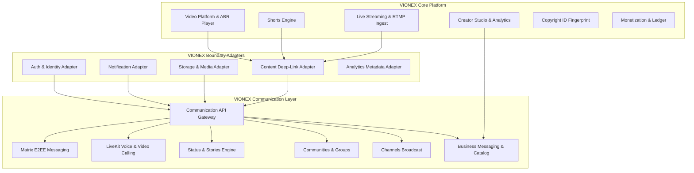
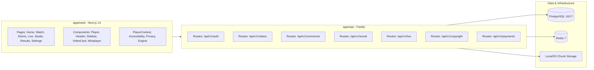
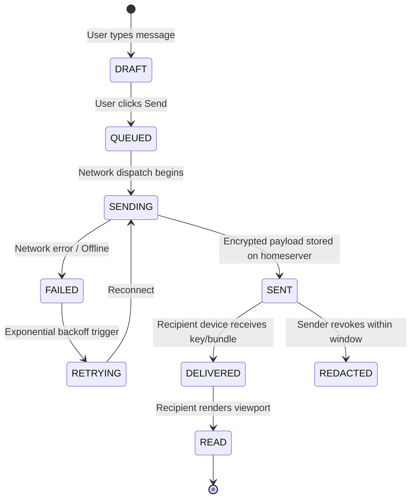
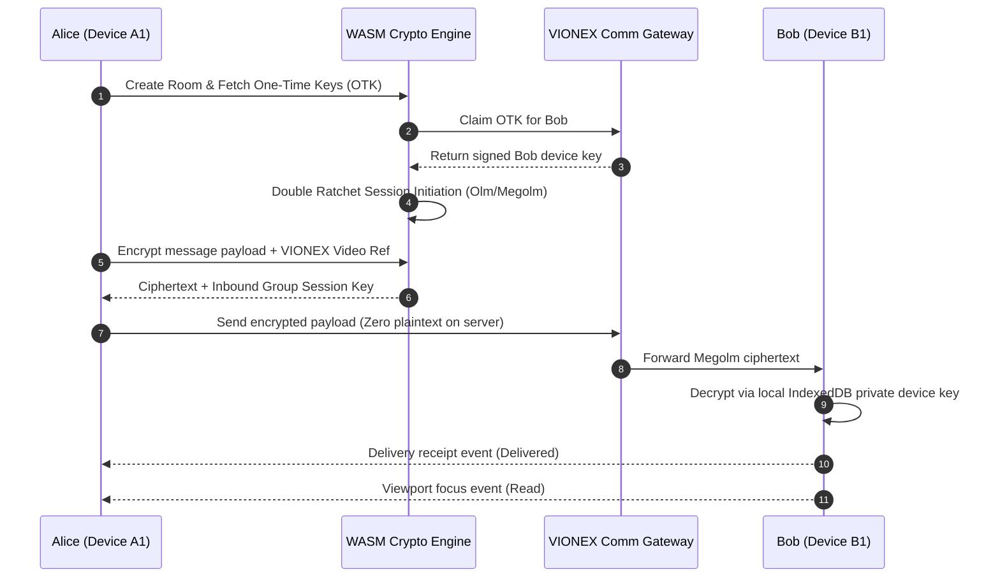
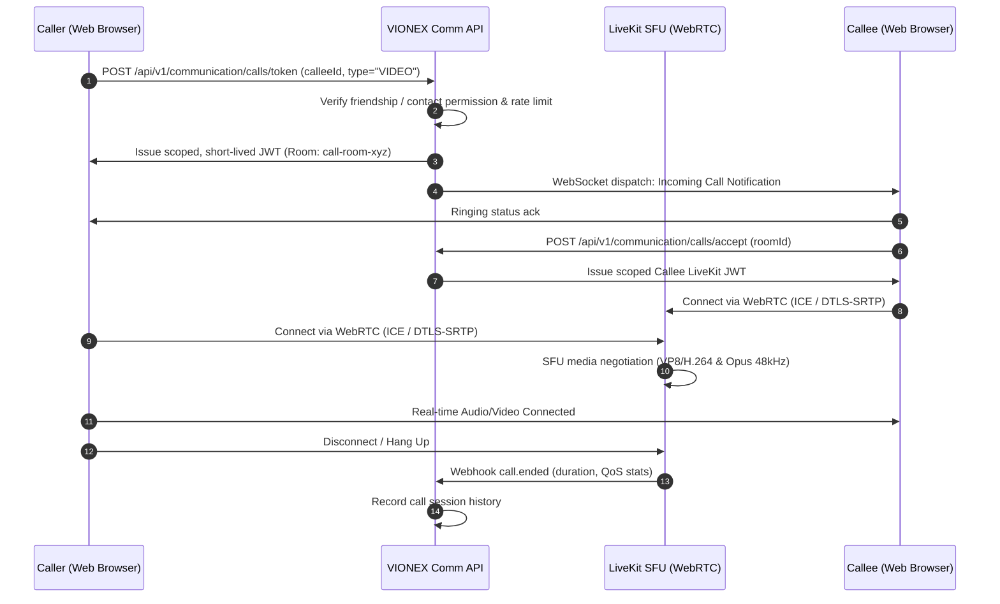

# VIONEX Communication Architecture Blueprint
## WhatsApp-Equivalent Secure Real-Time Communication Ecosystem (Add-Only Expansion)

---

## 1. System Overview & Non-Destructive Principles

The VIONEX platform is expanding from a video sharing, streaming, and creator platform into an integrated digital communication and media platform.

### Core Architecture Axiom
$$\text{TARGET} = \text{EXISTING VIONEX} + \text{COMMUNICATION SUBSYSTEM}$$

The existing VIONEX engine—including 4K/1080p ABR HLS streaming, WebRTC P2P delivery offloading, YouTube Shorts shelf, Studio Creator Analytics, Two-Tower DNN recommendations, and Copyright Audio Fingerprinting—remains **100% operational and untouched**.



---

## 2. Current VIONEX Architecture Map & Boundaries



### Existing Workspaces & Responsibilities:
- **`apps/api`**: Fastify HTTP & WebSocket server on Port 4000.
- **`apps/web`**: Next.js 14 Web Application on Port 3000.
- **`packages/database`**: Prisma ORM client with PostgreSQL persistence.
- **`packages/auth`**: JWT session management, Bcrypt hashing, CSRF protection.
- **`packages/storage`**: Local and S3 chunked media storage.
- **`packages/player`**: HLS adaptive bitrate and Web Audio processing.
- **`services/*`**: Asynchronous BullMQ workers for media transcoding, transcription, and acoustic fingerprinting.

---

## 3. Communication Boundary & New Subsystems

To keep the boundary clean, isolated, and reversible, communication logic attaches through:

1. **`packages/communication`**: Core protocol, cryptographic abstractions, state machines, and adapters.
2. **`apps/api/src/routes/communication.ts`**: Subsystem API gateway mounted under `/api/v1/communication`.
3. **`apps/web/src/app/(communication)`**: Clean client routes:
   - `/messages` & `/messages/[id]`
   - `/calls`
   - `/status`
   - `/communities`
   - `/channels`
   - `/business`

---

## 4. Open-Source Foundations & Technology Selection

| Domain | Selected Foundation | License | Role in VIONEX |
|---|---|---|---|
| **E2EE Messaging** | [Matrix JavaScript SDK](https://github.com/matrix-org/matrix-js-sdk) | Apache 2.0 | Client-side protocol, room sync, Olm/Megolm E2EE |
| **Crypto Core** | [Matrix Rust SDK / matrix-sdk-crypto-wasm](https://github.com/matrix-org/matrix-sdk-crypto-wasm) | Apache 2.0 | Cryptographic double ratchet, device cross-signing, key backup |
| **Voice & Video Calling** | [LiveKit](https://github.com/livekit/livekit) | Apache 2.0 | High-performance WebRTC SFU, adaptive bitrate, simulcast |
| **Media Transport Fallback** | Coturn (STUN/TURN) | BSD 3-Clause | Symmetric NAT traversal, relay for corporate/mobile firewalls |
| **Authoritative State** | PostgreSQL 16/17 + Prisma | Apache 2.0 | VIONEX Identity, Status, Communities, Channels, Business metadata |

---

## 5. Authoritative Source of Truth Matrix

No property or data entity has competing or ambiguous ownership.

| Data Class | Authoritative System | Secondary / Cache | Justification |
|---|---|---|---|
| **User Identity & Auth** | VIONEX PostgreSQL (`User`, `UserSession`) | Redis token cache | Single source of truth for accounts across VIONEX. |
| **Communication Device Keys** | Matrix Crypto Subsystem (WASM / IndexedDB) | Matrix Homeserver | Private keys NEVER leave client devices; public keys signed by cross-signing root. |
| **Encrypted 1:1 / Group Messages** | Matrix Protocol Store | Client IndexedDB | End-to-end encrypted payloads cannot be decrypted or stored in plaintext by VIONEX server. |
| **Realtime Call Media & SFU** | LiveKit WebRTC Engine | Ephemeral in-memory | Low-latency audio/video packets routed via SFU; zero media stored unless consented. |
| **Status / Stories Metadata** | VIONEX PostgreSQL (`Status`, `StatusAudience`) | Redis 24h TTL cache | Strict server-side audience ACL enforcement and automatic 24-hour expiration. |
| **Communities & Roles** | VIONEX PostgreSQL (`Community`, `CommunityMember`) | In-memory permission cache | RBAC security enforcement (Owner, Admin, Moderator, Member). |
| **Broadcast Channels** | VIONEX PostgreSQL (`ChannelBroadcast`, `ChannelPost`) | Redis fanout cache | Public and private one-way creator updates and media distribution. |
| **Business Messaging & Catalog** | VIONEX PostgreSQL (`BusinessAccount`, `BusinessCatalogItem`) | Search index | Business profiles, automated responses, and product catalog items. |

---

## 6. Database Models (Prisma Extensions)

The following models are added to `packages/database/prisma/schema.prisma` without altering existing tables:

```prisma
// -------------------------------------------------------------
// VIONEX COMMUNICATION EXPANSION SCHEMA
// -------------------------------------------------------------

enum CommunicationDeviceStatus {
  UNVERIFIED
  VERIFIED
  BLOCKED
  REVOKED
}

enum CallType {
  VOICE_DIRECT
  VIDEO_DIRECT
  VOICE_GROUP
  VIDEO_GROUP
}

enum CallStatus {
  RINGING
  CONNECTED
  RECONNECTING
  COMPLETED
  BUSY
  MISSED
  DECLINED
  FAILED
}

enum StatusPrivacyMode {
  CONTACTS_ONLY
  SELECTED_AUDIENCE
  EXCLUDE_SPECIFIC
}

enum CommunityRole {
  OWNER
  ADMIN
  MODERATOR
  MEMBER
}

enum BusinessRole {
  OWNER
  ADMIN
  SUPERVISOR
  AGENT
}

model CommunicationIdentity {
  id                   String                  @id @default(uuid())
  userId               String                  @unique
  user                 User                    @relation(fields: [userId], references: [id], onDelete: Cascade)
  matrixUserId         String                  @unique
  publicKeyFingerprint String?
  isE2EEActive         Boolean                 @default(true)
  createdAt            DateTime                @default(now())
  updatedAt            DateTime                @updatedAt

  devices              CommunicationDevice[]
  statuses             Status[]
  statusViews          StatusView[]
  statusReactions      StatusReaction[]
  communityMemberships CommunityMember[]
  channelFollows       ChannelFollower[]
  callsParticipated    CallParticipant[]
  businessAccount      BusinessAccount?

  @@index([userId])
  @@index([matrixUserId])
}

model CommunicationDevice {
  id              String                    @id @default(uuid())
  identityId      String
  identity        CommunicationIdentity     @relation(fields: [identityId], references: [id], onDelete: Cascade)
  deviceId        String                    @unique
  deviceName      String
  platform        String                    // "web", "ios", "android", "desktop"
  clientIp        String?
  userAgent       String?
  status          CommunicationDeviceStatus @default(UNVERIFIED)
  crossSignedKey  String?
  lastSeenAt      DateTime                  @default(now())
  createdAt       DateTime                  @default(now())
  revokedAt       DateTime?

  @@index([identityId])
  @@index([deviceId])
}

model CallSession {
  id            String            @id @default(uuid())
  initiatorId   String
  callType      CallType
  status        CallStatus        @default(RINGING)
  liveKitRoomId String            @unique
  startedAt     DateTime          @default(now())
  connectedAt   DateTime?
  endedAt       DateTime?
  durationSec   Int               @default(0)

  participants  CallParticipant[]

  @@index([initiatorId])
  @@index([status])
}

model CallParticipant {
  id          String                @id @default(uuid())
  callId      String
  call        CallSession           @relation(fields: [callId], references: [id], onDelete: Cascade)
  identityId  String
  identity    CommunicationIdentity @relation(fields: [identityId], references: [id], onDelete: Cascade)
  role        String                @default("PARTICIPANT") // CALLER, CALLEE, ADMIN
  isMuted     Boolean               @default(false)
  isCameraOff Boolean               @default(false)
  joinedAt    DateTime              @default(now())
  leftAt      DateTime?

  @@unique([callId, identityId])
}

model Status {
  id          String            @id @default(uuid())
  authorId    String
  author      CommunicationIdentity @relation(fields: [authorId], references: [id], onDelete: Cascade)
  contentType String            // "TEXT", "IMAGE", "VIDEO", "VIONEX_SHARE"
  text        String?
  mediaUrl    String?
  vionexRef   Json?             // { type: "VIDEO", id: "vid-123", timestamp: 42 }
  privacyMode StatusPrivacyMode @default(CONTACTS_ONLY)
  createdAt   DateTime          @default(now())
  expiresAt   DateTime          // Strictly enforced 24h expiration

  audiences   StatusAudience[]
  views       StatusView[]
  reactions   StatusReaction[]

  @@index([authorId])
  @@index([expiresAt])
}

model StatusAudience {
  id          String   @id @default(uuid())
  statusId    String
  status      Status   @relation(fields: [statusId], references: [id], onDelete: Cascade)
  targetId    String   // VIONEX User ID granted/excluded
  isExcluded  Boolean  @default(false)

  @@unique([statusId, targetId])
}

model StatusView {
  id          String                @id @default(uuid())
  statusId    String
  status      Status                @relation(fields: [statusId], references: [id], onDelete: Cascade)
  viewerId    String
  viewer      CommunicationIdentity @relation(fields: [viewerId], references: [id], onDelete: Cascade)
  viewedAt    DateTime              @default(now())

  @@unique([statusId, viewerId])
}

model StatusReaction {
  id          String                @id @default(uuid())
  statusId    String
  status      Status                @relation(fields: [statusId], references: [id], onDelete: Cascade)
  userId      String
  user        CommunicationIdentity @relation(fields: [userId], references: [id], onDelete: Cascade)
  emoji       String
  createdAt   DateTime              @default(now())

  @@unique([statusId, userId])
}

model Community {
  id          String            @id @default(uuid())
  name        String
  description String?
  avatarUrl   String?
  bannerUrl   String?
  isVerified  Boolean           @default(false)
  createdAt   DateTime          @default(now())
  updatedAt   DateTime          @updatedAt

  members     CommunityMember[]
  channels    CommunityTopic[]

  @@index([name])
}

model CommunityMember {
  id          String                @id @default(uuid())
  communityId String
  community   Community             @relation(fields: [communityId], references: [id], onDelete: Cascade)
  identityId  String
  identity    CommunicationIdentity @relation(fields: [identityId], references: [id], onDelete: Cascade)
  role        CommunityRole         @default(MEMBER)
  joinedAt    DateTime              @default(now())

  @@unique([communityId, identityId])
}

model CommunityTopic {
  id          String    @id @default(uuid())
  communityId String
  community   Community @relation(fields: [communityId], references: [id], onDelete: Cascade)
  name        String
  description String?
  isAnnouncementOnly Boolean @default(false)
  createdAt   DateTime  @default(now())
}

model ChannelBroadcast {
  id          String            @id @default(uuid())
  ownerId     String
  name        String
  slug        String            @unique
  description String?
  iconUrl     String?
  isVerified  Boolean           @default(false)
  createdAt   DateTime          @default(now())
  updatedAt   DateTime          @updatedAt

  followers   ChannelFollower[]
  posts       ChannelPost[]

  @@index([slug])
}

model ChannelFollower {
  id          String                @id @default(uuid())
  channelId   String
  channel     ChannelBroadcast      @relation(fields: [channelId], references: [id], onDelete: Cascade)
  identityId  String
  identity    CommunicationIdentity @relation(fields: [identityId], references: [id], onDelete: Cascade)
  followedAt  DateTime              @default(now())

  @@unique([channelId, identityId])
}

model ChannelPost {
  id          String           @id @default(uuid())
  channelId   String
  channel     ChannelBroadcast @relation(fields: [channelId], references: [id], onDelete: Cascade)
  content     String
  mediaUrls   String[]         @default([])
  vionexRef   Json?            // Native video/short/live stream embed reference
  reactions   Json             @default("{}") // { "🔥": 42, "❤️": 89 }
  viewsCount  Int              @default(0)
  createdAt   DateTime         @default(now())

  @@index([channelId, createdAt])
}

model BusinessAccount {
  id          String                @id @default(uuid())
  identityId  String                @unique
  identity    CommunicationIdentity @relation(fields: [identityId], references: [id], onDelete: Cascade)
  name        String
  category    String
  description String?
  website     String?
  phone       String?
  hours       Json?                 // Mon-Fri 09:00 - 18:00
  welcomeMsg  String?
  awayMsg     String?
  isVerified  Boolean               @default(false)
  createdAt   DateTime              @default(now())

  catalog     BusinessCatalogItem[]
  agents      BusinessAgent[]
}

model BusinessCatalogItem {
  id          String          @id @default(uuid())
  businessId  String
  business    BusinessAccount @relation(fields: [businessId], references: [id], onDelete: Cascade)
  title       String
  description String?
  priceCents  Int
  currency    String          @default("USD")
  imageUrl    String?
  sku         String?
  isAvailable Boolean         @default(true)
  createdAt   DateTime        @default(now())

  @@index([businessId])
}

model BusinessAgent {
  id          String          @id @default(uuid())
  businessId  String
  business    BusinessAccount @relation(fields: [businessId], references: [id], onDelete: Cascade)
  userId      String
  role        BusinessRole    @default(AGENT)
  assignedAt  DateTime        @default(now())

  @@unique([businessId, userId])
}
```

---

## 7. Message State Machine & Idempotency Architecture

Every direct message transitions through deterministic states driven by cryptographic transport events:



### Idempotency Guarantee
1. Every message generated on a client is assigned a UUID v4 `clientTransactionId`.
2. The server de-duplicates any transaction ID received within a 24-hour sliding window.
3. Retrying transmission during network handoffs or browser refresh never creates duplicate messages.

---

## 8. E2EE Cryptographic Ratchet Architecture



---

## 9. Voice & Video Calling (LiveKit SFU)



---

## 10. Native VIONEX Content Deep-Link Integration

When any VIONEX user shares a video, short, live stream, playlist, or timestamped discussion into chat, the message payload carries a structured reference:

```json
{
  "vionexReference": {
    "version": "1.0",
    "type": "VIDEO",
    "id": "vid-demo-002",
    "timestampSec": 124,
    "title": "View From A Blue Moon: 4K Cinematic Action Camera Breakdown",
    "creatorHandle": "mkbhd",
    "thumbnailUrl": "/videos/blue_moon.jpg",
    "embedRoute": "/watch/vid-demo-002?t=124"
  }
}
```

This ensures:
1. **Zero Media Duplication**: 4K video is not re-uploaded into chat storage.
2. **Interactive Preview**: Recipients get an interactive preview card with instant one-click playback.
3. **Context Preservation**: Exiting playback immediately restores active chat state.

---

## 11. Security Model & Defensive Isolation

1. **SSRF Link Preview Protection**: Link previews for external websites run through an isolated, sandboxed fetch service that disallows loops to `127.0.0.1`, RFC1918 private subnets, cloud metadata (`169.254.169.254`), and internal service DNS.
2. **Zero Plaintext Inspection**: Private messages are protected by client-side Megolm ratchet encryption. The VIONEX backend never inspects, indexes, or logs private E2EE content.
3. **No Demo-User Fallbacks**: In production, unauthorized requests fail with HTTP 401/403.
4. **Rate Limiting**: Multi-tiered token bucket per user ID, IP address, and device fingerprint.

---

## 12. Verification & Golden User Journeys

The testing suite validates 10 automated Golden User Journeys:

1. **Journey 1**: 1:1 Direct E2EE Messaging (Send, Deliver, Read, Reply, React, Edit, Delete).
2. **Journey 2**: Multi-Device Synchronization & QR Device Linking / Revocation.
3. **Journey 3**: Group Chat Lifecycle (Creation, Invites, Member Removal, Admin Permissions).
4. **Journey 4**: 1:1 Voice Calling (Ring, Accept, Mute, Reconnect, Call History).
5. **Journey 5**: HD Video Calling & Screen Sharing with LiveKit SFU.
6. **Journey 6**: 24-Hour Ephemeral Status / Stories with strict ACL audience enforcement.
7. **Journey 7**: Community Spaces (Announcements, Topic Groups, Moderation).
8. **Journey 8**: Creator Broadcast Channels (Followers, 1-way Updates, Reactions, Polls).
9. **Journey 9**: Business Messaging (Inbox, Automated Welcome, Catalog Sharing).
10. **Journey 10**: Native VIONEX Video, Short, & Live Stream Content Sharing.
